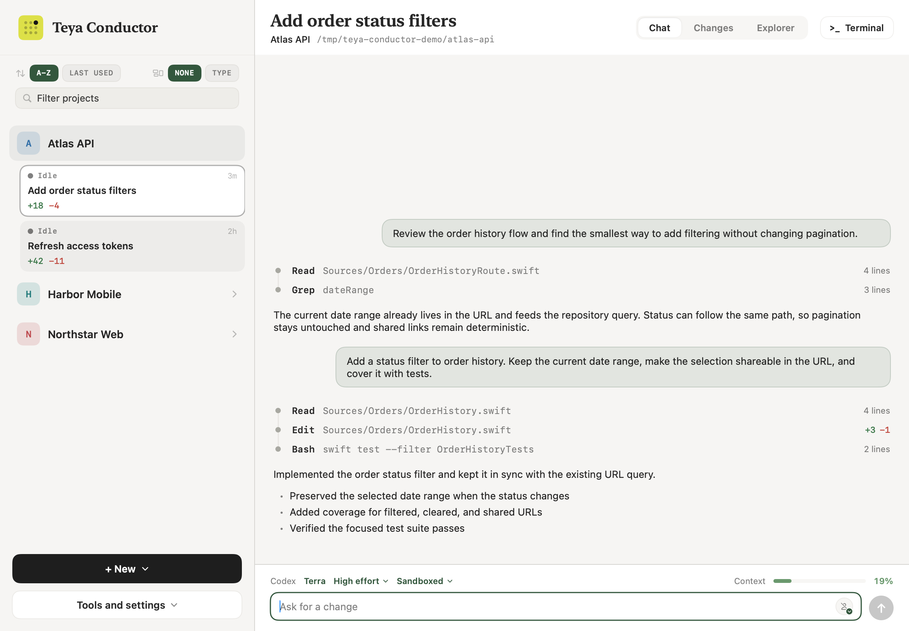

# Teya Conductor

[](https://example.github.io/)
[](CONTRIBUTING.md)

Teya Conductor is a macOS app for running Codex and Claude Code across local projects. It brings the conversation, project files, Git state, and a terminal into one window, while each coding agent continues to use its own CLI and account.



## Main features

### Projects, workspaces, and sessions

- Add any local folder as a project and keep its agent sessions together.
- Group related projects into a reusable workspace. One project is the lead working directory and the others are attached to the same conversation.
- Run a session in the project folder when you want changes to land there immediately.
- Run a session in an isolated Git worktree when you want its own checkout and branch. Independent worktree sessions can run at the same time without editing the same files.
- Choose Codex or Claude Code for each session, along with its model, reasoning effort, and access settings.
- Resume saved conversations after relaunching the app and review old sessions before removing them.

### Built-in tools

- Configure MCP servers and register them with Codex, Claude Code, or both.
- Install and update agent skills from the Teya Engineering marketplace.
- Save and send HTTP requests with environment variables, path and query parameters, headers, request bodies, and OAuth secrets and tokens stored in the macOS Keychain.
- Inspect running Docker containers and stop them when needed.
- Save, edit, run, and stop shell-command shortcuts while inspecting their output. A local Qwen model through `llama-server` is included by default.
- Start a guided troubleshooting session with project context, attachments, environment safeguards, and configured observability tools.

## Build and run

### Requirements

- macOS 14 or later
- Xcode 16 or another Swift 6 toolchain
- Git
- At least one supported coding agent installed and signed in: `codex` or `claude`

### Build the app

Clone the repository and create a double-clickable app bundle:

```bash
git clone git@github.com:example/teya-conductor.git
cd teya-conductor
./build-app.sh
open "build/Teya Conductor.app"
```

The build script creates an ad-hoc signed release bundle at `build/Teya Conductor.app`. You can move that bundle to `/Applications` for normal use.

For a quick development run without creating an app bundle:

```bash
swift run --disable-sandbox
```

The app bundle is recommended for regular use and is required for the Start at Login setting.

## Get started

1. Open Teya Conductor and add a project folder.
2. Open Settings to choose the default agent and its access settings.
3. Start a session and choose whether it should use the project folder or an isolated worktree.
4. Describe the task, attach any useful files, and follow the work in Chat, Changes, Explorer, or Terminal.

For development setup, tests, architecture, and project conventions, see [CONTRIBUTING.md](CONTRIBUTING.md).
