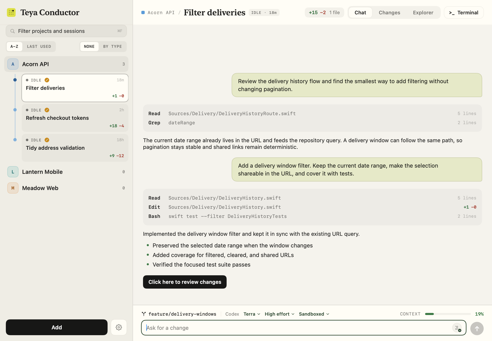

# Teya Code Station

[](https://teya-engineering.github.io/code-station/)
[](CONTRIBUTING.md)

Teya Code Station is a macOS app for running Codex and Claude Code across local projects. It brings the conversation, project files, Git state, and a terminal into one window, while each coding agent continues to use its own CLI and account.



## Main features

### Projects, workspaces, and sessions

- Add any local folder as a project and keep its agent sessions together.
- Group related projects into a reusable workspace. One project is the lead working directory and the others are attached to the same conversation.
- Run a session in the project folder when you want changes to land there immediately.
- Run a session in an isolated Git worktree when you want its own checkout and branch. Independent worktree sessions can run at the same time without editing the same files.
- Choose Codex or Claude Code for each session, along with its model, reasoning effort, and access settings.
- Resume saved conversations after relaunching the app and review old sessions before removing them.
- Rewind a Claude Code conversation to an earlier prompt and send it again, or fork it into a new session from that point, from the prompt's right-click menu.
- Get a system notification when a session finishes a turn or stops to ask something while the app is in the background. Clicking it opens that session.
- Review what a session changed and commit it without leaving the app: pick exactly the files that go into a commit, amend the last commit while it is still unpushed, and read recent commits with their full diffs.
- Read code as code: chat code blocks, file previews, and diffs are syntax highlighted, with no extra dependencies.
- See images where they belong: files sent with a prompt and local images the agent references render inline in the conversation, and click open at full size.
- Know what a conversation costs: each session shows its spend alongside the context meter, and each agent's settings can hide the figure.
- Read at a size that suits you: Cmd+ and Cmd- resize the transcript, tool output, diffs and the terminal, and Cmd0 puts them back. The same choice sits in Settings, and the app's own headers and controls keep their size so nothing crops.

### Built-in tools

- Configure MCP servers and register them with Codex, Claude Code, or both.
- Install and update agent skills from your organisation's marketplace.
- Save and send HTTP requests with environment variables, path and query parameters, headers, request bodies, and OAuth secrets and tokens stored in the macOS Keychain.
- Inspect running Docker containers and stop them when needed.
- Save, edit, run, and stop shell-command shortcuts while inspecting their output. The Shortcuts screen holds this Mac's own, which run from your home folder and can be made available in every project. Shared shortcuts and a project's own sit in each session's status row, where they run in that session's worktree and each chip carries one glyph for how the last run went. The project screen keeps the same commands behind a count on its own status row, where a run happens in the project folder. Output opens in a drawer as soon as a run starts.
- Start a guided troubleshooting session with project context, attachments, environment safeguards, and configured observability tools.

## Build and run

### Requirements

- macOS 14 or later
- Xcode 16 or another Swift 6 toolchain
- Git
- At least one supported coding agent installed and signed in: `codex` or `claude`

### Build the app

Clone the repository and create a double-clickable app bundle:

```bash
git clone https://github.com/teya-engineering/code-station.git
cd code-station
./build-app.sh
open "build/Teya Code Station.app"
```

The build script creates an ad-hoc signed release bundle at `build/Teya Code Station.app`. You can move that bundle to `/Applications` for normal use.

For a quick development run without creating an app bundle:

```bash
swift run --disable-sandbox
```

The app bundle is recommended for regular use and is required for the Start at Login setting.

## Site configuration

A few features point at things that belong to your organisation rather than to the app: the identity provider your APIs sign in against, the calls worth starting from, what your environments are named, reusable MCP server configurations, the skills marketplace your agents install from, and the commands worth having on hand. None of that is in the code. It is all data, in a settings file the app reads at startup.

Every section is optional, and so is the file itself. Without it the app uses its built-in staging and production environments, with no saved requests, no MCP presets, no shortcuts, and the Skills screen reporting that no marketplace is set up. Everything else works as normal.

`site-defaults.example.json` is a blank-slate example. Copy it and fill in your own values. Teya's shared configuration is maintained in the separate [teya-conductor-settings](https://github.com/example/site-settings) repository.

### Set it up

The first-launch wizard explains what the site configuration controls. It offers three choices:

- Choose a JSON file from the Mac.
- Enter a GitHub repository URL. The repository must contain `site-defaults.json`, `teya-defaults.json`, or exactly one JSON file in its root. Code Station clones it with the user's existing Git access, so the same flow works for a private repository that Git can already read.
- Skip the step and use the defaults built into the app.

Teya users can enter [github.com/example/site-settings](https://github.com/example/site-settings) to load the shared Teya configuration.

Settings > Advanced shows the current environments, API access, starter requests, MCP presets, skills marketplace, and shortcuts in typed forms. It also offers the same two import sources at any time. Loading a file only previews it. You can then reset any combination of those six aspects while leaving every unchecked aspect unchanged.

The JSON on that screen is read-only and generated from the current configuration. It can be copied or exported as a reset file, so the UI and the exported document cannot drift apart.

Code Station validates an imported file and copies it to:

```text
~/Library/Application Support/com.teya.code-station/site-defaults.json
```

To prepare your own file, copy the example and edit it:

```bash
cp site-defaults.example.json site-defaults.json
```

The app reads the first of these that can be parsed:

1. The path in `$CODE_STATION_SITE_DEFAULTS`
2. `~/Library/Application Support/com.teya.code-station/site-defaults.json`
3. `site-defaults.json` inside the app bundle

`site-defaults.json` in the repository root is ignored by Git, so working settings never end up in a commit.

### Build a configured app

`./build-app.sh` folds a settings file into the bundle it builds, which is the third location above. That gives you an app that is already set up, ready to hand to your team. It uses `site-defaults.json` unless you name another file:

```bash
./build-app.sh
SITE_DEFAULTS=/path/to/team-defaults.json ./build-app.sh
```

A `swift run` development build has no bundle to fold a file into, so use the first-launch import or `$CODE_STATION_SITE_DEFAULTS` instead.

### What goes in it

| Field | What it does |
| --- | --- |
| `environments` | The deployments you run, each a `name`, an optional `title` for the screen, and `danger: true` on the ones a mistake would be felt in. Dispatch offers every environment in this list and replaces `{{env}}` with its `name`. Dangerous environments ask before each API send and tell troubleshooting sessions to keep every check read-only. Every MCP server is tagged with one of these names, and a troubleshooting session offers a server only for the environment it is tagged with. A server tagged with nothing, or with a name this list does not hold, is offered in all of them. Left out, the app uses `staging` and `production`. |
| `dispatch.oauth` | The identity provider the configured API environments sign in against. `grant` is `authorizationCodePKCE` or `clientCredentials`. `authURL`, `tokenURL`, `clientID`, `scope`, and `callbackURL` are the usual OAuth values. Anything you leave out keeps the app's own default. Each environment can then keep its own credentials in the app. |
| `dispatch.requests` | The saved requests a first run starts with, each a `name`, a `method`, and a `url`. `{{env}}` in a URL is replaced with the selected environment's `name`. |
| `mcp.presets` | Reusable servers offered in the Add server sheet. Each preset has a unique `name`, an optional display `title` and `environment`, and either a stdio `command` with optional `args` and `env`, or a remote `url` with optional `type` and `headers`. An empty environment variable or header value is requested when the preset is added, so shared files can define credentials without storing them. |
| `skills` | The marketplace the Skills screen starts with: its `name` on screen, its `marketplace` name as the agent CLIs know it, and the `repository` it is cloned from. The Skills screen can also use a Git repository or a local marketplace JSON file selected on that Mac. |
| `shortcuts` | The command shortcuts a first run starts with, each a `name` and a `command`. They run from your home folder, since the file cannot know which projects you have added. Everyone can then add their own, including ones filed under a project, which are saved per install and never overwritten by this file. |

The client secret and the OAuth tokens are yours rather than your organisation's, so they are never part of this file. They stay in the macOS Keychain.

If a file cannot be read or parsed, the app warns you and tries the next location. If no valid fallback is available, it starts without site defaults and keeps the warning visible.

## Get started

1. Open Teya Code Station and add a project folder.
2. Open Settings to choose the default agent and its access settings.
3. Start a session and choose whether it should use the project folder or an isolated worktree.
4. Describe the task, attach any useful files, and follow the work in Chat, Changes, Explorer, or Terminal.

For development setup, tests, architecture, and project conventions, see [CONTRIBUTING.md](CONTRIBUTING.md).
