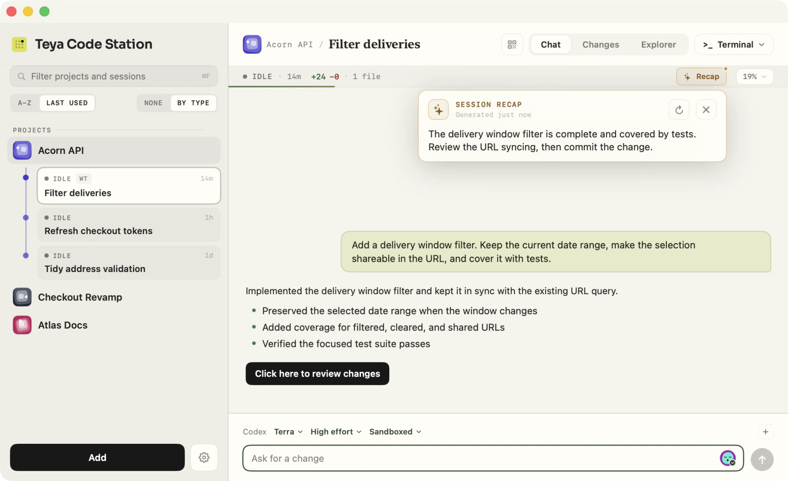

# Teya Code Station

[](https://github.com/teya-engineering/code-station/releases/latest) [](https://teya-engineering.github.io/code-station/) [](CONTRIBUTING.md) [](LICENSE)

Teya Code Station is a macOS app for running Codex and Claude Code across local projects. It keeps conversations, files, Git changes, and terminals in one window while each coding agent continues to use its own CLI and account.

[](https://teya-engineering.github.io/code-station/)

## Why Code Station

- **Run agents side by side.** Choose Codex or Claude Code for each session, then run independent sessions in their own Git worktrees without having them edit the same checkout.
- **Work across repositories.** Group related projects into a reusable workspace with one lead working directory and attach the others to the same conversation.
- **Come back caught up.** Ask for a short session recap at any time, or create one automatically when a turn finishes while you are elsewhere. Recaps stay outside the conversation, so they do not add noise to the agent's context.
- **Stay close to the work.** Review and commit changes, browse files, use a terminal, manage MCP servers and skills, send HTTP requests, inspect Docker, run shortcuts, and start guided troubleshooting without leaving the app.

[](https://teya-engineering.github.io/code-station/#recaps)

The [project website](https://teya-engineering.github.io/code-station/#features) has the complete feature overview and more product screenshots.

## Download and install

Download the signed and notarized app from the [latest GitHub release](https://github.com/teya-engineering/code-station/releases/latest). Open the `.dmg`, drag **Teya Code Station** to **Applications**, then launch it from there.

You need macOS 14 or later and at least one supported coding agent installed and signed in: `codex` or `claude`.

## Build from source

You need:

- macOS 14 or later
- Xcode 16 or another Swift 6 toolchain
- Git
- At least one supported coding agent installed and signed in: `codex` or `claude`

Clone the repository and create a double-clickable app bundle:

```bash
git clone https://github.com/teya-engineering/code-station.git
cd code-station
./build-app.sh
open "build/Teya Code Station.app"
```

The build script creates an ad-hoc signed release bundle at `build/Teya Code Station.app`. You can move it to `/Applications` for normal use. The app bundle is required for the Start at Login setting.

For a quick development run without creating an app bundle:

```bash
swift run --disable-sandbox
```

## Team configuration

Code Station can optionally load a site configuration with the environments, API access, MCP presets, skills marketplace, starter requests, and shortcuts that belong to your organisation. Every section is optional, and the rest of the app works without a configuration file.

Teya users can import [`github.com/saltpay/code-station-settings`](https://github.com/saltpay/code-station-settings) during first-launch setup. To create a configuration for another organisation, start with [`site-defaults.example.json`](site-defaults.example.json).

See the [site configuration guide](docs/site-configuration.md) for import options, lookup rules, build integration, and the field reference.

## Development

See [CONTRIBUTING.md](CONTRIBUTING.md) for development setup, tests, architecture, and project conventions.
